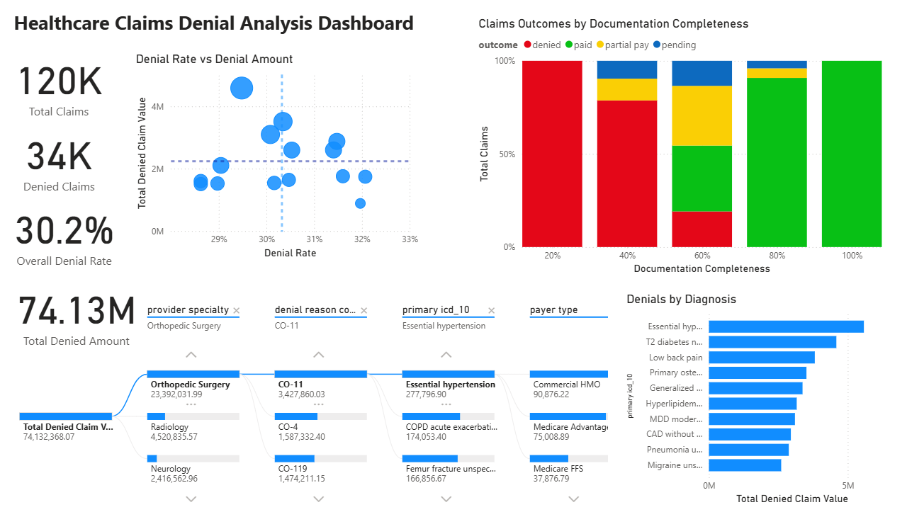

# Healthcare-Claims-Denial-Analysis  
## Project Overview  
This project identifies the root causes of claims denials across a dataset of 120,000 healthcare claims, testing whether documentation completeness, provider specialty, payer type, and diagnosis code are associated with denial risk. Using a synthesized dataset from Kaggle, I analyzed denial reason codes and denial rates across each of these factors to isolate which ones are associated with denial outcomes.

## Business Problem  
Health insurance denials are a massive issue in our healthcare system and affect providers and patients alike. Denials account for increased administrative costs, delayed care, long waits for reimbursement, and barriers for patients. Without knowing the main drivers of claims denials, it is difficult for providers and patients to avoid a claim being denied.  
## Business Questions  
- Which denial codes occur most frequently?
- Which specialties or payers are associated with higher denials?
- How much revenue is tied to denied claims?
- Is there one main driver of claims denials?
- What could providers do to reduce claims denials?
## Tools  
- SQL
- BigQuery
- Power BI
- Excel

## Dataset  

Source: Kaggle DenialIQ: 120K Medical Claims | X12 Denial Codes  
This analysis uses a dataset of 120K synthetic claims sourced from Kaggle designed to mimic real-world claims denials  

Variables included:
- Claim outcome (paid, denied, partial pay, pending)
- X12 denial reason codes
- Documentation completeness score
- Primary ICD-10 
- Payer type
- Provider specialty
- Claim dollar amount

## Methodology  
- Examined available variables and selected appropriate columns to answer business questions, excluding administrative, metadata, and identifier fields that did not contribute to the analysis
- Checked for null values in the denial reason code and validated that they occurred only among paid, partially paid, and pending claims, with no denied claims containing a null denial reason code. Retained these records for subsequent analysis
- Calculated dollar amount of total claims denials using DAX to create a  calculated measure in Power BI to quantify the financial impact of claims denials
- Calculated the frequency of each denial reason code to identify the most common reasons for denial
- Further investigated an unexpected relationship in the decomposition tree in Power BI between essential hypertension and orthopedic surgery
- Compared claim outcome against documentation completeness to determine a relationship between documentation completeness and denial risk
- Grouped documentation completeness into low, medium, or high and compared denial rates across provider specialty and payer type within each category

## Key findings
- The most common denial reason code was CO-11 which stands for "Diagnosis/Procedure Mismatch"
- Claims with documentation completeness of 0.49 and below were universally denied. Claims with documentation of 0.73 completeness and above were approved
- When documentation completeness remains the same, provider specialty does not support a meaningful difference in denial rate
- Across payers, claim denial risk remains similar even when documentation completeness remains the same
- There is no clear pattern of denial between essential hypertension and orthopedic surgery; rather, essential hypertension appears the most in the dataset and is not a specific reason for orthopedic surgery denials

## Power BI Dashboard
- Denial rate and denial amount scatterplot: compares denial rate with denied claim value across ICD-10 diagnoses to identify whether diagnoses with higher denial rates also account for greater dollar value in denied claims
- Denials by documentation completeness stacked column chart: displays the breakdown of paid, partially paid, pending, and denied claims across documentation completeness levels, making changes in claim outcome visible as documentation completeness increases
- Decomposition tree: Enables exploration of denied claim value across provider specialty, denial reason code, primary ICD-10 code, and payer type to identify patterns and investigate potential contributors to denials
- Denials by diagnosis clustered bar chart: compares claim volume, denied claims, and denial rate across ICD-10 diagnoses to provide context for whether high denial counts reflect greater denial risk or simply higher claim volume

